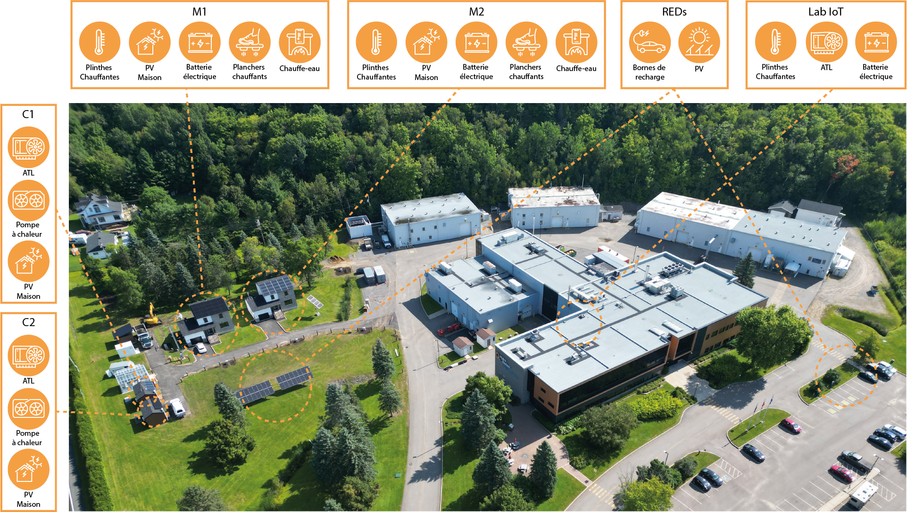
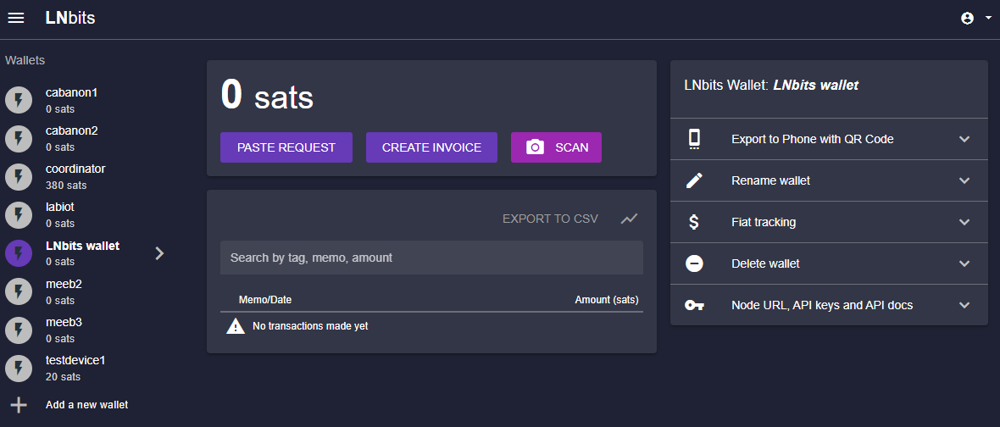
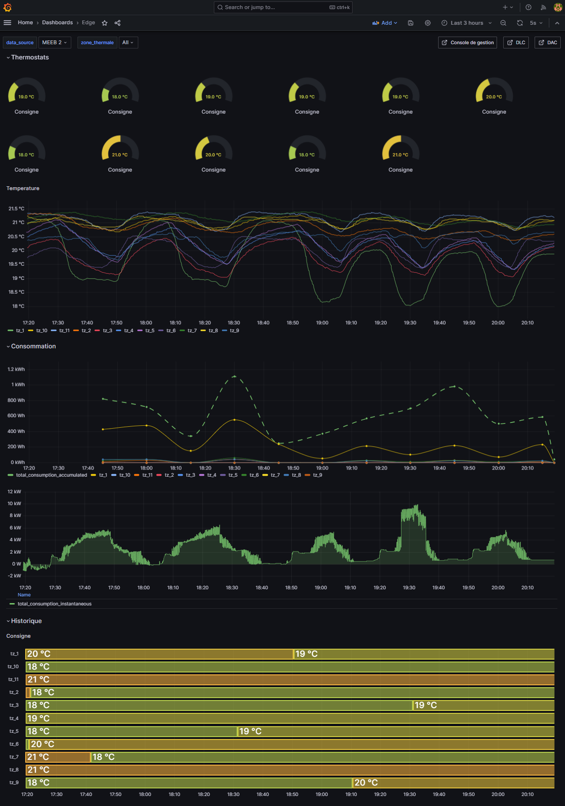

The [Laboratoire des technologies de l’énergie](https://ici.radio-canada.ca/nouvelle/2065864/laboratoire-transition-energetique-shawinigan-electricte) (LTE) from Shawinigan is one of the labs of the [Institut de recherche d'Hydro-Québec](https://www.hydroquebec.com/innovation/en/technological-evolution/innovative-strength/). The LTE is at the forefront of energy research. The LTE houses multiple facilities dedicated to advancing technologies in Lithium Batteries, energy efficiency, and client applications. Their research spans electric vehicles, distributed generation, building controls, and more. The following image shows the buildings that belong to the LTE and few of the technologies that are deployed on each building.

Recently, we embarked on an exciting project to deploy the OSED platform across six buildings within the LTE campus. Our objective was to create a cohesive, intelligent system capable of responding to grid demands that were transfered by an EDGE coordinator. Our hope was to enhance the building operations to reduce operational costs without sacrifizing comfort.

## Deployment on the cloud 
The cloud instances of the OSED platform were deployed using Kubernetes on AWS. Communication with the EDGE devices was facilitated by [Astarte](https://docs.astarte-platform.org/astarte/latest/001-intro_user.html). A custom module was developed to leverage Astarte's capabilities for user authentication and secure communication channels. This module efficiently transferred grid function requests to the users, ensuring reliable and secure operations.

## Deployment on the EDGE
The EDGE instances were deployed across various devices, tailored to the specific needs of each building. The table below outlines the buildings, their respective EDGE devices, the building actuators utilized, and the technologies integrated on the building intelligence of each building:

| Building  | Hardware      | Actuator       | Technologies                                                        |
|-----------|---------------|----------------|---------------------------------------------------------------------|
| House 1   | Raspberry pi 4| EDGE X         | Thermostats Sinope                                                  |
| House 2   | Intel Mini PC  | EDGE X         | Thermostats Sinope                                                  |
| IoT laboratory 1  | Raspberry pi 4| Home Assistant | Thermostats Sinope                                                  |
| IoT laboratory 2  | Intel mini PC  | Home Assistant | Thermostats Sinope, water heater, battery with Schneider inverter, EV charger V1G |
| Shed 1     | Raspberry pi 4| Home Assistant | Thermostats Sensibo                                                 |
| Shed 2     | Raspberry pi 4| Home Assistant | Thermostats Sensibo                                                 |

While additional technologies are present in the buildings, they are not yet fully integrated into the system.

## Tests executed

Numerous tests were conducted during the winter of 2023-2024. These tests included the optimization of dynamic tariffs, participation in day-ahead markets, and direct control of devices. The results provided valuable insights into the system's performance under real-world conditions.

## LnBits integration

We deployed an instance of an [LNbits server](https://lnbits.cloud.lirei.io/wallet) on the cloud to explore financial incentives for user participation. A grid function utilizing direct load control was developed, integrating with the LnBits server to manage wallets and payments. This setup enabled us to create financial rewards for users who participated in the grid function, adding an extra layer of engagement and motivation.

## Results 

The laboratory tests demonstrated the effectiveness of the Building Intelligence system in responding to grid functions deployed by the EDGE Coordinators. However, the tests also highlighted the need for a more robust system to manage microservices on the EDGE. Additionally, systems for handling exceptions and unexpected behaviors are essential for ensuring stability and reliability.

