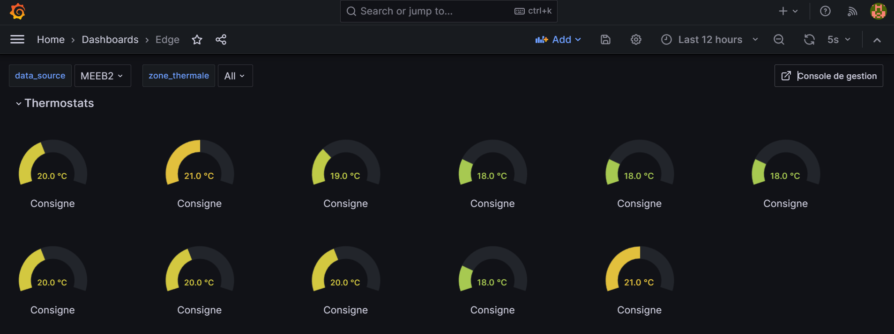
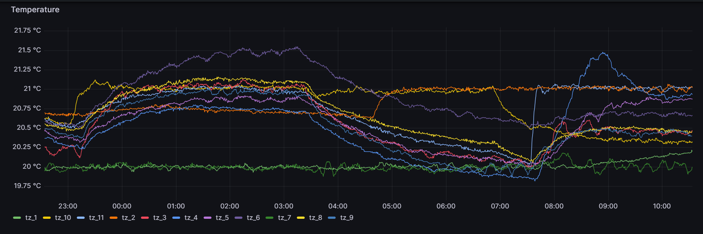
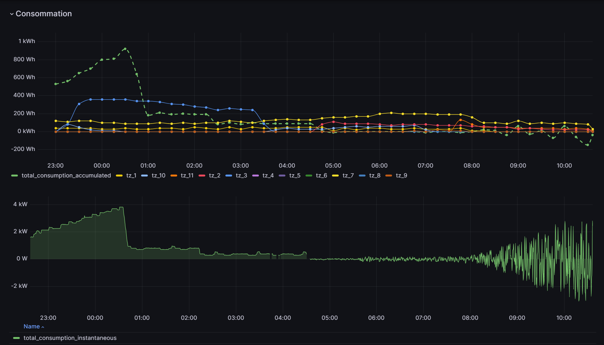
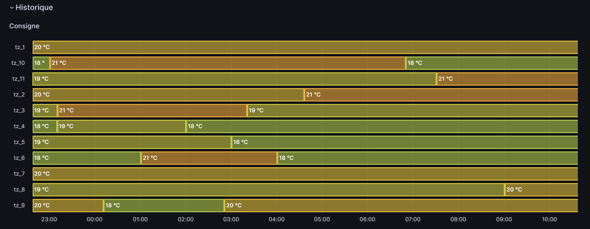

# Visualization

To ensure an efficient visualization of the real-time and historical data of our buildings for the OSED (Open Source EDGE DERMS) project, we have chosen Grafana. Grafana is a robust open-source software that offers interactive analysis and visualization capabilities.

## What is Grafana?

Grafana is a multi-platform open-source software that enables interactive analysis and visualization, and has been available since 2014. It generates graphs, diagrams, and web alerts when connected to various compatible data sources, which could be either local or cloud-based databases. Grafana is known for its extensibility facilitated by a plugin system.

## Usage of Grafana in our Project

In the OSED project, we have selected Grafana to create a dashboard that effectively illustrates the present and historical status of our buildings. Drawing on data from "Edge Intelligence" (InfluxDB), this dynamic dashboard is devised to present different pieces of real-time and previous data:

- The target temperatures (setpoints) for each thermal zone (TZ).

- The existing and past temperatures in each thermal zone (TZ).

- The current, previous, and accumulated instantaneous energy consumption for each thermal zone (TZ), as well as every building.

- Review of the setpoint history over time.

Moreover, Grafana's interactive panels facilitate a more in-depth analysis of values by concentrating on a specific time period. This feature is particularly useful for examining trends and changes across different time frames, allowing for precise tracking and optimization of building energy efficiency.

## How to Access?

The Grafana instance has been installed on an 'On-premise' server in an LTE laboratory. To access it, you must have connectivity to our OpenZiti network at the URL http://grafana.lte. If you have direct access to the server, you can employ its IP address and port 3000.

## To Learn More

For more comprehensive information about our implementation of Grafana, kindly refer to the README.md file in our [project repository](https://gitlab.com/hydropersonal/poctes/edge/grafana).